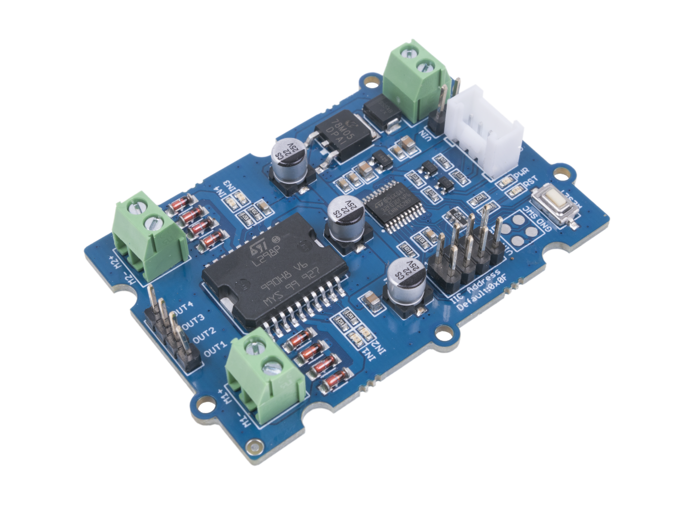

# Dissecting I2C - Motor Control Module
The CTI has given us the gift of inexpensive I2C and we're trying to build out examples in github  (link in here)

This article describes how to take apart examples, monitor the signals and write the drivers for the CTI.. I'm concentrating on Grove modules for now.

[L298P Motor Driver board](https://wiki.seeedstudio.com/Grove-I2C-Motor-Driver-L298P/ "L298P Motor Driver board")

