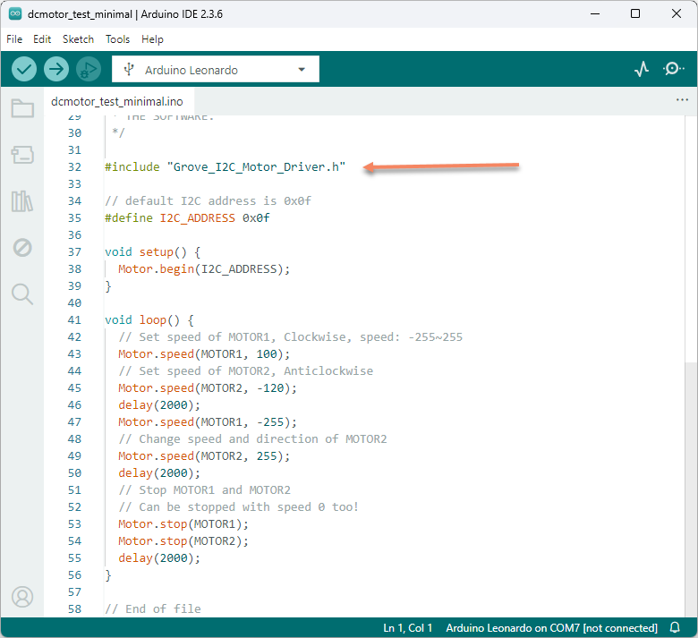
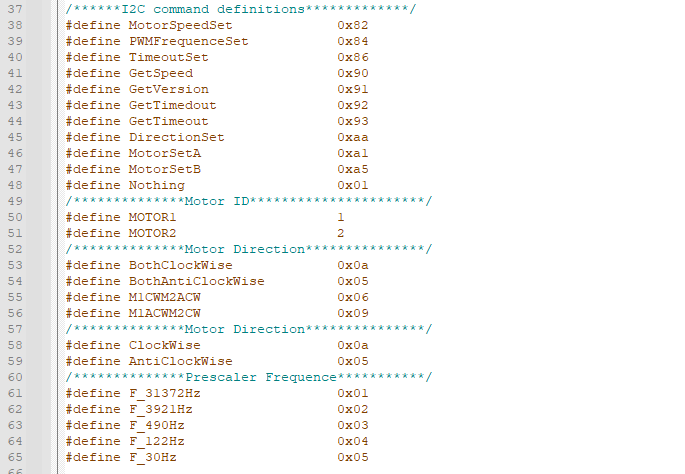
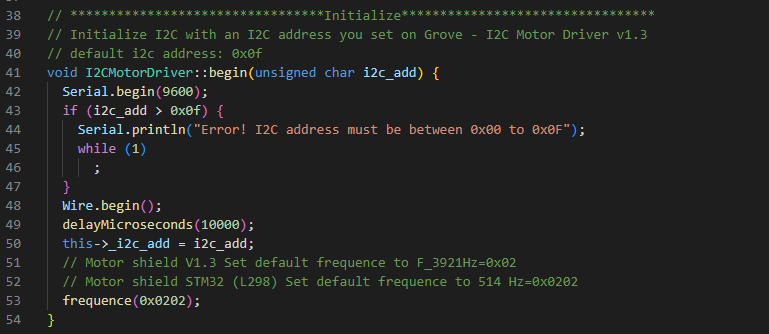
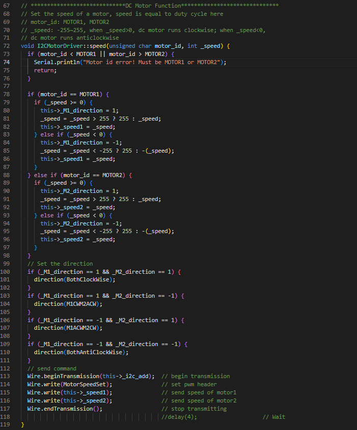
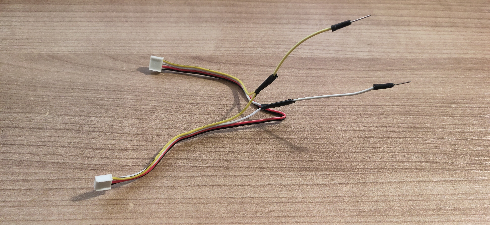
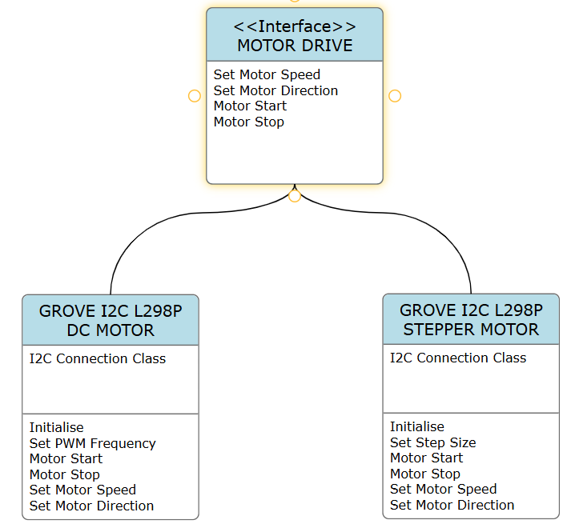

# Dissecting I2C - Motor Control Module
The CTI has given us the gift of inexpensive I2C and we're trying to build out examples in github  (link in here)

This article describes how to take apart examples, monitor the signals and write the drivers for the CTI.. I'm concentrating on Grove modules for now.

[L298P Motor Driver board](https://wiki.seeedstudio.com/Grove-I2C-Motor-Driver-L298P/ "L298P Motor Driver board")

The nice thing about using grove examples is that they come with Arduino and sometimes Pico examples. I like to do a hardware test first, so I get out my Arduino Leonardo and install the example library.

I load it up and it all works as expected. Next I would normally look at the datasheet for the chip we're going to be communicating with (L298P), but in this case there is another MCU (Microcontroller) being used to deal with the communications. So let's have a look at the Arduino code.

First we'll look at the DC motors - 

Not much to see here, but we can deduce what the example does - It loops setting and reversing both motors, with delays of 2 seconds.

But it looks as if we need to find out what Motor.begin, Motor.speed and Motor.stop does..

Grove_I2C_Motor_Driver.h and Grove_I2C_Motor_Driver.cpp can be found in the downloaded zip files.

Grove_I2C_Motor_Driver.h is the definition file and is great for finding I2C commands and registers.. And we find this goldmine.

Grove_I2C_Motor_Driver.cpp is the source-code.

## Motor.begin

Not much to do here, mainly setting the I2C device address and wait 10ms then set the default frequency for the device... in this case STM32 L298??

## Motor.speed

And it looks like 
It sets the direction
using the set direction command 0xaa

it sends MotorSpeedSet command 0x82

Let's confirm by breaking out my trusty scope and breakout lead

The first waveform is this

And we can see the following messages

### Set Motor PWM Frequency Example

x0F x84 x02 x02 

x0F is the device address

x84 PWM Frequency set

x02 x02 is the frequency data

This is the Motor.begin part in the C++

The rest is the code setting Motor.speed.

### Set Motor Direction Example
x0F xAA x0A x01

xAA is the Direction set

x0A is both clockwise

x01 ? think this ignored
 
### Set Motor Speed Example
x0F x82 x64 x00

x82 is Motor Speed Set

x64 Motor 1 Speed

x00 Motor 2 Speed

In short it all looks very straight-forward.

Next I will get the LabVIEW project from Github and build the base classes, I tend to put a fair bit of effort into this to make it look nice. Taking my lead from Derricks good work.

The base library is all written in LabVIEW 2020 to keep compatibility for people using older versions of LabVIEW.

Here's a very rough UML diagram of where I'm going with this, OO is not really my bag, so this is a work in progress.

Next article will describe the example. (after I get it working)

