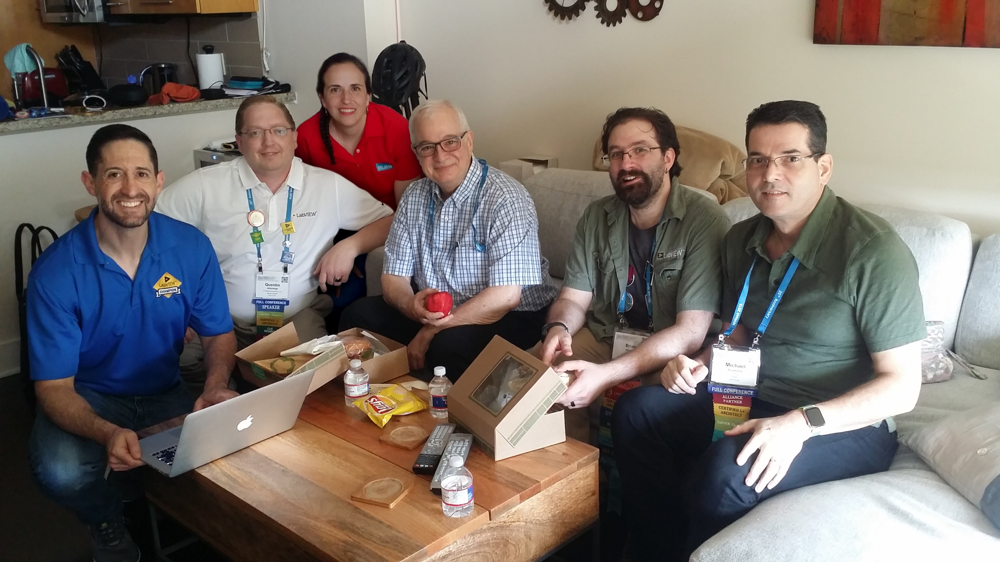




<b>Nancy Henson</b> joins the Board of Directors.



<b>Danielle Jobe</b> resigns from the Board of Directors.




A presentation about the G Idea Exchange along with the results from the Summer of LabVIEW Competition 2023.



<b>Christian Butcher</b> and <b>Enrique Noe Arias</b> join the Board of Directors.



<b>Jesper Kjaer Soerensen</b> joins the Board of Directors.



<b>François Normandin</b> resigns from the Board of Directors.




Do you have the next great idea for an open-source toolkit in LabVIEW but need help implementing it? Would you like to help new upcoming toolkits get funded and get initialized? Is your company looking for an open-source project to invest in? The G Idea Exchange is a sub-committee under the non-profit GCentral. It promotes and supports new open-source toolkits and ideas for improving LabVIEW, helping open-source ideas get off the ground.



The collection of funding through CauseVox was cancelled in the end of 2023 and the video is no longer matching the current events but kept for historical purposes.








Do you have a toolkit that would benefit the community but don't have the resources to finish it? Do you have an awesome idea for tools that would solve problems facing the community but don't know how to bring it about? Introducing GCentral's G Idea Exchange where you can kudo an idea by helping to sponsor it. Help get money to polish off that tool or get someone with the right background to create it and pool our resources to maximize everyone's return on investment.







GCentral is a community-run initiative that aggregates different package types (VIPackages, NIPackages, GPackages) in one website so that the LabVIEW community can find, share, and collaborate on packages, independent of package type. In this presentation, we'll teach how we've created GCentral's website and underlying indexing technology so that you can contribute by enhancing or adding new functionality.






<b>Elijah Kerry</b> resigns as NI's representative on the Board of Director and is succeeded by <b>Eric Reffett</b>.



<b>François Normandin</b> joins the Board of Directors.



<b>Elijah Kerry</b> joins the Board of Directors as NI's representative.



<b>Fabiola De La Cueva</b> resigns from the Board of Director and is succeeded by <b>Chris Cilino</b>.



The initial GCentral proposal at the American Certified LabVIEW Architects Summit




GCentral is officially formed as a Nonprofit Corporation in the State of Texas, USA. With the first members of the Board of Directors being:

<ul><li><b>Quentin Alldredge</b></li>
<li/><b>Fabiola De La Cueva</b></li>
<li/><b>Danielle Jobe</b></li>
</ul>



The inital meeting occured on the last day of NIWeek 2019 in Chris Cilino's living room. In attendance from left to right was: Chris Cilino, Quentin Alldredge, Fabiola De La Cueva, Jeff Kodosky (a.k.a. the Father of LabVIEW), Brian Hoover, and Michael Aivaliotis. Here Chris presented his pitch for the idea and mission that would become GCentral.




